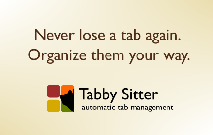

# Tabby Sitter



> A Chrome extension that automatically groups your tabs by site rules.

## Overview

**Tabby Sitter** watches your browser tabs and automatically moves them into organized Chrome tab groups based on URL patterns you define. Set your rules once and let Tabby Sitter herd your tabs into place. It lives in Chrome's side panel, which also gives you a full tab manager: a live tab tree, saved groups, duplicate handling and side-by-side tabs.

## Features

### Rules and grouping

- **Rule-based auto-grouping**: Define URL patterns (e.g. `github.com`, `stackoverflow.com`) and assign them to named, coloured tab groups. Multiple patterns per rule; groups are created on the fly.
- **Three match modes**: `contains` (substring of the full URL), `domain` (hostname: `github.com` also matches `gist.github.com`, never `notgithub.com`) and `regex` (case-insensitive regular expression).
- **Auto-ungrouping**: Tabs that navigate away from a rule's sites leave that rule's group. Tabs opened from a grouped tab stay in its group unless a rule says otherwise (Settings > Keep tabs in their group).
- **Respects manual moves**: Tabs you drag in or out of groups (in the panel or the tab strip) are left alone by the rules until you choose "Let rules manage" from the tab menu. "Always group this site here" creates or extends a domain rule from any tab.
- **Organize**: The wand button (or `Ctrl/Cmd+Shift+O`) applies your rules to the window; Shift-click organizes all windows. Optionally sort unmatched tabs by domain.

### Side panel tab manager

- **Live tab tree**: Search, multi-select, keyboard navigation, drag & drop in and out of groups, an all-windows view, and a right-click menu (move to group, new group, pin, unload, close). Rename and recolour groups inline. Open it from the toolbar icon or `Ctrl/Cmd+Shift+Y`.
- **Saved groups**: Save a group (or a tab selection), optionally closing it, and restore it later in this or a new window with its title, colour and tab order. Restored tabs are never auto-closed or regrouped by rules.
- **Tidy**: Sort a group's tabs by site, unload a whole group, or merge same-named groups across windows.
- **Side by side tabs** (Chrome 155+): Hover a tab and click the split icon (or select two tabs and press `S`) to open it beside the current tab. Tabby Sitter moves, groups and pins the tab as needed so Chrome accepts the pair; pairs show as one joined row, stay together when dragged or sorted, and are left alone by rules and duplicate auto-close. On older Chrome, Settings explains why it is unavailable.

### Housekeeping

- **Smart duplicate handling**: Optionally stop the same page being open twice, across all windows (or only for chosen domains). Tracking parameters (`utm_*`, `fbclid`, ...) and `#fragments` are ignored, and you can add more. A new duplicate tab is closed and switches to the existing one, with an Undo; a tab you navigate to a duplicate is never closed, only flagged ("Switch & close this" / "Keep both"). A Duplicates view lists clusters with "Keep this one" and "Close all duplicates", and the toolbar icon can show the count.
- **Auto-unload**: Optionally unload tabs idle for 15 minutes to 4 hours to free memory (never the active or audible tab, pinned tabs only if you allow it, and per-domain exceptions).

### Settings, sync and privacy

- **Sync file**: Link a JSON file in a folder you already sync (Dropbox, iCloud, Syncthing, Obsidian vault) to keep rules, settings and saved groups in step across computers. No server, no account. Manual export/import and a starter config are also included.
- **Light and dark themes**: Follows your system or can be forced in Settings > Appearance.
- **Minimal permissions**: `tabs`, `tabGroups`, `storage`, `sidePanel`, `alarms`. No host access, no content scripts, nothing sent anywhere.

## Installation (Developer Mode)

1. **Build the extension** (needs Node.js 24; with [mise](https://mise.jdx.dev) run `mise install` first and it is pinned for you):
   ```bash
   npm install
   npm run build
   ```

2. **Open Chrome Extensions page**:
   Navigate to `chrome://extensions/`

3. **Enable Developer Mode**:
   Toggle the switch in the top-right corner.

4. **Load Unpacked**:
   Click **Load unpacked** and select the `dist/` folder inside this project.

5. **Pin the Extension** (optional):
   Click the puzzle icon in Chrome's toolbar, find **Tabby Sitter**, and click the pin to keep it visible.

## Usage

1. Click the **Tabby Sitter** icon in your Chrome toolbar (or press `Ctrl/Cmd+Shift+Y`) to open the side panel.
2. Go to the **Rules** tab and click **+ Add rule**:
   - **Patterns**: One or more patterns, separated by commas, newlines, or semicolons (e.g. `github.com, gitlab.com`).
   - **Match Mode**: `Contains` (default), `Domain` or `Regex`.
   - **Group Name**: e.g. `Dev`, `Docs`.
   - **Color**: Pick a colour for the group.
   - **Description** (optional): A note for yourself.
3. Click **Add Rule**.
4. Open a tab matching that pattern and it snaps into the configured group.
5. To apply your rules to tabs that are already open, click the **Organize** (wand) button in the panel header or press `Ctrl/Cmd+Shift+O`.

The **Tabs** tab is your tab manager, **Saved** holds saved groups, and **Settings** has duplicate handling, auto-unload, sync, appearance and the rest.

## Example Rules

| Patterns | Group Name | Color | Mode | Description |
|----------|-----------|-------|------|-------------|
| `github.com, stackoverflow.com` | Dev | Blue | contains | Coding sites |
| `docs\.google\.com` | Work | Green | regex | Google Docs (regex) |
| `youtube.com` | Media | Red | domain | Videos (incl. `m.youtube.com`) |
| `x.com, twitter.com, instagram.com` | Social | Cyan | domain | Social media (`contains` would also catch `netflix.com`) |

## Config File Sync

Tabby Sitter can keep your rules, settings and saved groups in step across computers using **a file you choose**. There is no server and no account: Tabby Sitter only reads and writes that local file, and your own sync service (Dropbox, iCloud Drive, Google Drive, OneDrive, Syncthing, an Obsidian vault, etc.) copies it between machines.

**Disclaimer:** Tabby Sitter never uploads anything and is not responsible for how the file is shared: where it is stored, who can access it, or how it is backed up. The file contains your rules and the URLs of your saved groups, so only keep it in a location you trust.

1. Machine 1: Settings -> **Sync file** -> **Create sync file...** and save it inside a synced folder.
2. Wait for your sync service to copy it to machine 2.
3. Machine 2: **Link existing file...** and pick the same file.
4. After restarting Chrome, click **Reconnect** so Chrome can access the file again.

Changes are written about 1.5 seconds after you make them and read when the panel opens or regains focus. If the file changed elsewhere, it is loaded automatically (with an Undo) unless you also changed something here, in which case you choose "Use file" or "Keep this device's". A file that cannot be read is never overwritten unless you confirm. You can choose whether saved groups and settings are included, and turn off automatic loading.

Where to put the file:

- **Dropbox**: create it inside your Dropbox folder, e.g. `~/Dropbox/tabby-sitter.conf.json`.
- **iCloud Drive**: pick "iCloud Drive" in the file dialog (on macOS `~/Library/Mobile Documents/com~apple~CloudDocs`). "Optimise Mac Storage" may evict the file; keep it downloaded.
- **Google Drive / OneDrive desktop apps**: use the synced folder and mark the file "available offline".
- **Obsidian vault**: put it in the vault folder (synced by Obsidian Sync, iCloud or git). With Obsidian Sync, turn on "Sync all other types" in its settings, otherwise `.json` files are not synced. Obsidian does not list `.json` files, so it won't clutter your notes.
- **Syncthing** or any other folder sync works the same way.

**Several Chrome profiles?** Each profile has its own copy of the extension, with its own rules, saved groups and linked file. Give each profile its own file (e.g. `tabby-sitter-work.conf.json` and `tabby-sitter-personal.conf.json`) to keep their setups separate, or link the same file in several profiles to share one setup. The optional "Profile name" field on the card only affects the suggested file name; it stays on that profile and is not written to the file.

Tip: avoid editing on two machines at the same time. If the "Sync file changed on another device" banner appears, pick which side to keep.

**Manual export/import** still works from the **Import & export** card in Settings. **Export…** downloads the same file format (rules, settings, saved groups), **Import…** merges or replaces, and files from older versions (rules only) are accepted. A **Starter Config** with example rules is also available.

## Development

The toolchain is pinned in `mise.toml`. With [mise](https://mise.jdx.dev) installed:

```bash
mise install         # Install the pinned Node.js
mise run setup       # npm ci
mise run check       # Build + test + lint
```

Or use npm directly:

```bash
npm install          # Install dependencies
npm run dev          # Start Vite dev mode with HMR
npm run build        # Type-check + bundle into dist/
npm run preview      # Preview the production build locally
```

## Development Stack

| Tech | Purpose |
|------|---------|
| TypeScript | Type-safe extension code |
| Vite 6 | Fast bundling |
| CRXJS | Chrome extension plugin for Vite |
| Manifest V3 | Modern Chrome extension format |

## License

MIT
